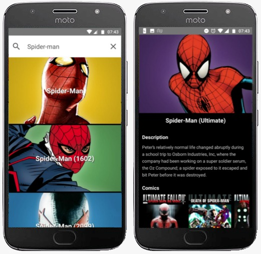

  <h3 align="center">React Native Heroes</h3>

---

## Overview

Research Marvel heroes to read additional information about them.

## Preview

## APIs

- [Marvel Developer Portal](https://developer.marvel.com/)

## Running the project

- You need to set up all the react-native enviroment
- Clone this repository
- Install all dependencies using the command `yarn`
- Fill the `.env` file
- Run `react-native run-android` while you are running a Android emulator

## Used technologies

- React Native
- React Navigation
- Redux
- Redux Thunk 
- Other React Native libs
